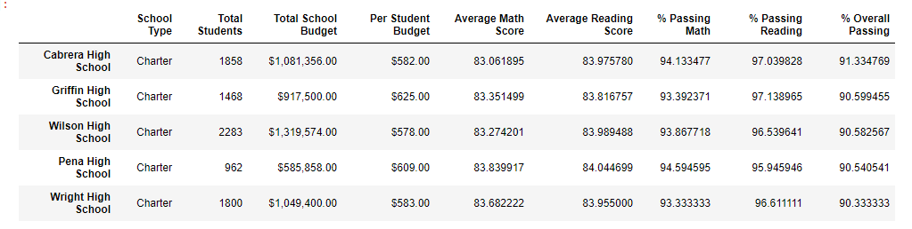
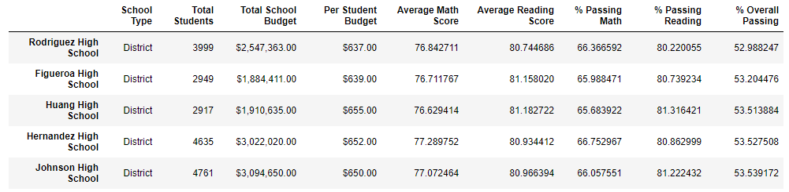
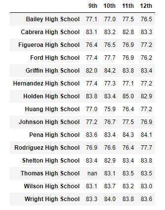
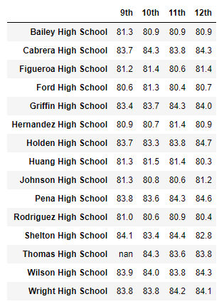
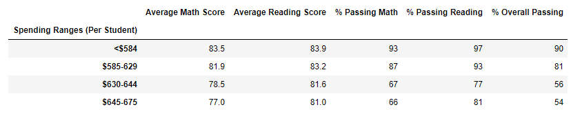
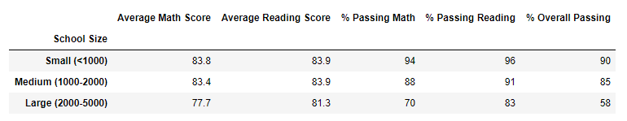
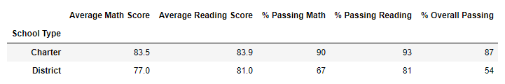

# School_District_Analysis
School_District_Analysis

# Updated School District Analysis
Per your request, I have cleaned the student names and removed the 9th graders's scores from Thomas High School  Their scores will no longer be impacted.  

## Updated District Summary

Removing students caused a decrease in the average math score, $ Passing Math, % PAssing Reading.  Overall Passing Percentage decreased 1%

## Updated School Summary

This will indicate where removing students will have an impact.  Thomas High SChool is a charter school, spending 578 a student.  Passing rates are 93% Math, 96% Reading and 90.9Percent overall

## High performaning schools

Thomas was a high performing school.  It is no longer in the list, with Wright now in the top 5

## Low Performing Schools

No Change

## Math Scores by Grade

Thomas High 9th Graders no longer included

## Reading Scores by Grade

Thomas High 9th Graders no longer included

## Scores by School Spending

Thomas was <584 a student.  In this range, average math score declines.  Percent passing for Math goes down, but percent passing for reading goes up.

## Scores by School Size

Percent passing for Charter schools decrease because of removing these scores, but per your directions, keeping the students in the total count
## Scores by School Type

